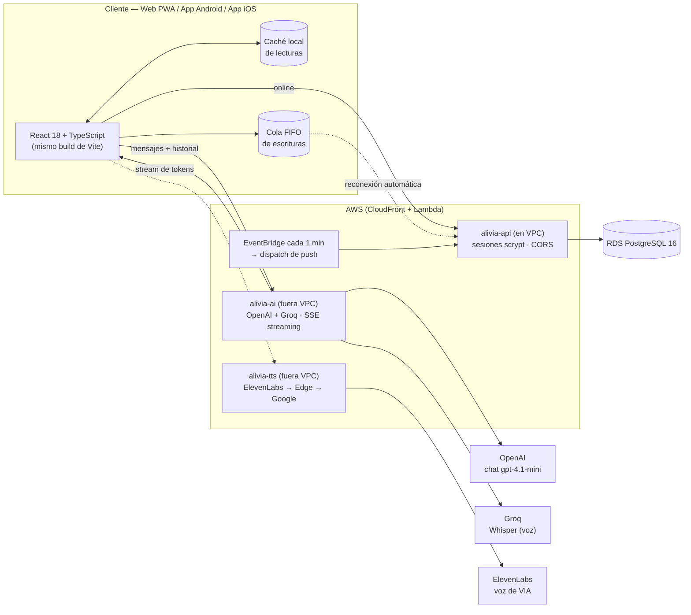
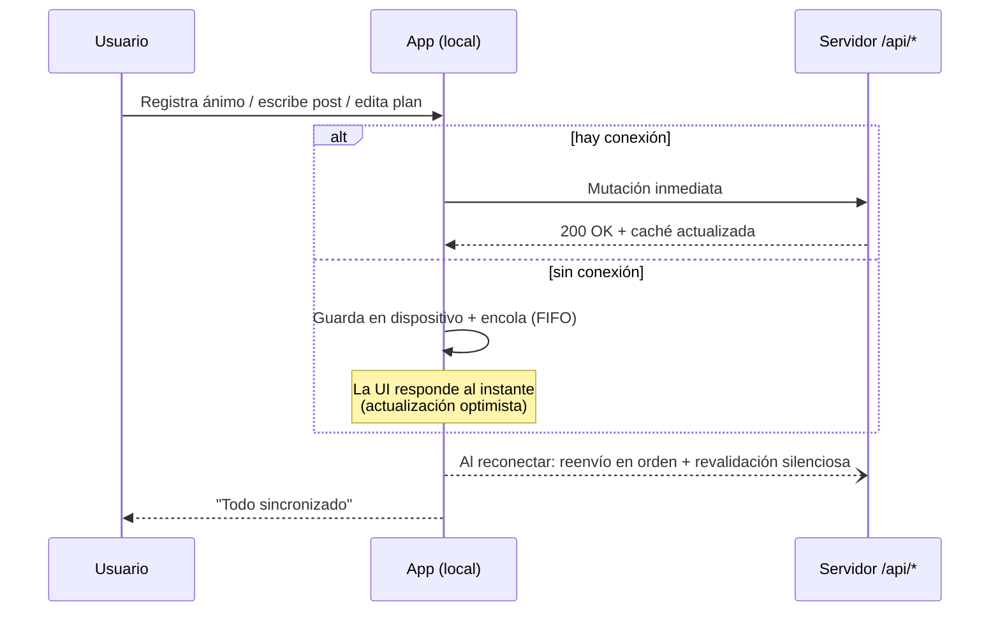

<div align="center">


### Refugio digital de bienestar mental para adolescentes y jóvenes

**Una sola base de código React. Web, Android e iOS. Cero dependencia de la señal.**

<br>

[](https://github.com/Imandro/AliviaApp/actions/workflows/ci.yml)
[](https://github.com/Imandro/AliviaApp/releases/latest)
[](LICENSE)
[](https://alivia.lat)


**[Abrir la web](https://d3gm2ziao5tkw0.cloudfront.net)** ·
**[Descargar Android](https://alivia.lat/descarga.html)** ·
**[Landing del proyecto](https://alivia.lat/landing.html)** ·
**[Reportar un problema](https://github.com/Imandro/AliviaApp/issues)**

</div>

---

> [!IMPORTANT]
> **Si estás en crisis, esto no sustituye la ayuda profesional.**
> Usa el botón **SOS** dentro de la app para ver líneas de crisis gratuitas de tu país,
> o contacta a tu servicio local de emergencias. No estás solo.

---

## Qué es ALIVIA

**ALIVIA** es una aplicación de bienestar mental diseñada para adolescentes y jóvenes. Ofrece herramientas de primera línea — ejercicios de respiración, diario terapéutico, chequeos de bienestar, chat con IA empática (VIA), biblioteca de guías psicoeducativas, juegos de regulación emocional y botón SOS con líneas de crisis — **todo funcionando 100 % offline** y sincronizando cuando hay conexión. Una sola base de código React sirve Web (PWA), Android nativo (Capacitor) e iOS nativo (Swift/WKWebView).

## Qué resuelve

| Problema | Cómo lo resuelve ALIVIA |
|---|---|
| **Ansiedad y pánico en el momento** | Respiración guiada (Box 4·4·4·4, 4-7-8, coherente 5·5), técnica Tierra 5-4-3-2-1 por voz, 4 ejercicios de afrontamiento paso a paso. |
| **Falta de espacio para desahogarse** | *Burn Journal*: escribe y observa tus pensamientos disolverse en partículas; todo local, privado y exportable. |
| **No saber cómo estás realmente** | Chequeo de bienestar cada 5 días (estrés, ansiedad, depresión) + **Radar de Bienestar** con gráficas de tendencia y rachas. |
| **Soledad y falta de apoyo** | Chat **VIA** (IA empática que pregunta *por qué* antes de aconsejar y te lleva a la función correcta), **Conecta con alguien** (plantillas para pedir ayuda a persona de confianza), comunidad anónima por temas. |
| **Crisis sin saber a quién llamar** | Botón **SOS** con líneas gratuitas de 6 países centroamericanos (NI, SV, GT, HN, CR, PA), contacto de emergencia configurable, detección de riesgo por niveles en el chat. |
| **Falta de hábitos y motivación** | 8 minijuegos de regulación (30 s–4 min), **Planes y Retos** con metas por área de vida y rachas, 20 recordatorios locales + push, biblioteca de guías interactivas con quiz. |
| **Privacidad y control de datos** | Bloqueo biométrico + cortina de privacidad, exportación JSON + HTML imprimible, i18n es/en, datos guardados primero en el dispositivo. |

## Contexto: Hackathon Kronox 2026

ALIVIA nace como proyecto para competir en la **categoría amateur del Hackathon Nicaragua 2026 Kronox**. El reto: crear una solución tecnológica de impacto social con recursos limitados. Elegimos salud mental juvenil porque es una necesidad real, silenciosa y desatendida en nuestra región.

## Por qué existe

**1 de cada 7** adolescentes entre 10 y 19 años vive con un trastorno mental diagnosticable, y cerca de la mitad nunca recibe atención (OMS). La ansiedad no espera a que haya turno disponible: aparece a las 2 a.m., antes de un examen, después de una pelea en casa.

ALIVIA pone herramientas de primera línea exactamente ahí — en el bolsillo, sin esperas, sin estigma y sin depender de que haya internet.

## Cuatro experiencias, un código

| Experiencia | Estado | Detalle |
|---|---|---|
| Web responsive | Producción ([alivia.lat](https://alivia.lat)) | SPA instalable como PWA: manifest + precache completo con Workbox |
| App Android nativa | APK en GitHub Releases · AAB listo para Play | Capacitor 8: ícono adaptativo, splash screen, permisos y firma propios |
| App iOS nativa | IPA ad-hoc / TestFlight | Shell Swift (WKWebView) propio con puente nativo: biometría, hápticos, notificaciones y cortina de privacidad. El IPA se firma en GitHub Actions |
| PWA instalada | iOS / Android | Al instalarse, el modo standalone redirige todo a la app |

El mismo bundle de Vite corre en las cuatro: no hay código duplicado ni pantallas que se porten a medias.

## Características

### En el momento — calma inmediata

| Módulo | Descripción |
|---|---|
| **Respiración guiada** | Box 4·4·4·4, Relajación 4-7-8 y Coherente 5·5. Círculo animado y mezclador de sonido sintetizado en tiempo real con Web Audio API (ruido marrón, olas, ondas binaurales): nada pregrabado. |
| **Tierra 5-4-3-2-1** | Técnica sensorial guiada por voz para volver al presente. |
| **Tarjetas de crisis** | Contenido validado para pánico, ganas de consumir, conflicto familiar y autolesión. |
| **SOS** | Líneas de crisis gratuitas de **6 países** (NI · SV · GT · HN · CR · PA), emergencias y contacto seguro configurable a un toque. |
| **Afrontamiento paso a paso** | Pausa somática · Reset frío · Surfear la urgencia · Plan de 10 minutos, cada uno con su guion. |

### Todos los días — construir bienestar

| Módulo | Descripción |
|---|---|
| **Burn Journal** | Diario terapéutico: escribe lo que te abruma y obsérvalo disolverse en partículas. |
| **Chequeo de bienestar** | Escala de estrés, ansiedad y depresión cada 5 días, con recomendaciones personalizadas. |
| **Radar de Bienestar** | Gráficas del estado de ánimo por rango (7 días, 30 días, todo) con tendencia y rachas. |
| **Planes y retos** | Metas por área de vida con racha de días consecutivos. |
| **Comunidad anónima** | Posts por temas y apoyo entre pares, sin perfiles públicos ni exposición. |
| **8 juegos de regulación** | Burbujas Calma · Memoria de Emociones · Ancla 5-4-3-2-1 · Secuencia VIA · Marea Respira · Cuadrícula de Anclaje · Piloto de Pensamientos · Semilla que Crece. Todos de 30 s a 4 min y diseñados para bajar revoluciones. |

### Acompañamiento

| Módulo | Descripción |
|---|---|
| **VIA (chat IA)** | Compañero conversacional con cara propia (mascota animada). Pregunta *por qué* te sientes así antes de aconsejar y te lleva directo a la función correcta de la app. Responde token a token (SSE), acepta entrada por voz (Whisper) y detecta riesgo por **niveles**, no por lista de palabras: distingue "me siento solo" de "quiero morirme" y reconoce texto separado (`q u i e r o m o r i r`). En crisis baja la temperatura, pide ayuda humana de forma directa y ofrece SOS. Si la IA falla o se acaban los intentos, responde igual con reglas locales. |
| **Biblioteca Inteligente** | Guías cortas por tema (ansiedad, familia, adicciones, amistades…) con pasos, checklist, quiz y progreso. |
| **Conecta con alguien** | Asistente en 5 pasos para preparar el mensaje a una persona de confianza: nombre, canal y plantillas listas para enviar. |
| **Recordatorios** | 20 recordatorios locales configurables (respiración, chequeo, diario, sueño, descanso de pantalla…) vía notificaciones del dispositivo, más push web con VAPID para los mismos recordatorios cuando hay suscripción registrada. |
| **Primera visita** | Onboarding de 5 pantallas (con qué luchas, qué estás viviendo, cómo quieres cuidarte, a quién contactar, qué quieres cambiar) y un tutorial en *spotlight* que señala VIA, SOS y la barra inferior sobre la interfaz real, una sola vez. |

### Privacidad y control

| Módulo | Descripción |
|---|---|
| **Bloqueo biométrico** | Huella o rostro para abrir la app (nativo) + cortina de privacidad en la lista de apps recientes. |
| **Exportar mis datos** | JSON completo para respaldo/portabilidad e informe HTML imprimible, generado en el propio dispositivo. |
| **Temas** | Calma Profunda (oscuro), Salvia Suave (claro) y monocromático, con transiciones suaves. |
| **Idioma** | Base i18n es/en para shell, navegación y perfil; el material psicoeducativo se mantiene en español revisado. |

## Arquitectura



> La IA y la voz viajan por funciones aparte (`alivia-ai`, `alivia-tts`) porque necesitan
> salir a internet, y la API de datos vive dentro del VPC para llegar a la base de datos:
> así se evita un NAT Gateway. Las claves (OpenAI, Groq, ElevenLabs, VAPID) se leen de
> Secrets Manager y **nunca entran en el bundle**.

- **Un código, tres nativos:** el mismo bundle corre en navegador, en el contenedor Capacitor (`android/`) y en el shell Swift (`ios/`), con puente nativo para biometría, hápticos, notificaciones y cortina de privacidad.
- **Backend serverless:** funciones Node en AWS Lambda con `pg`, contraseñas **scrypt**, sesiones Bearer de 30 días y esquema autogestionado (`db/schema.sql` + `db/functions.sql`).
- **Seguridad en el proxy de IA:** rate limit por IP (cubos de tokens), temperaturas y `max_tokens` acotados, lista de modelos en servidor y mensaje `system` forzado al principio: una petición manipulada no puede degradar las respuestas de crisis.
- **Tipografía y assets propios:** Quicksand variable + Lato auto-hospedadas; sin CDNs externos.

## Offline-first

La app no se apaga cuando se va la red. `src/utils/apiClient.ts` implementa:



1. **Lecturas con caché** — cada `GET` exitoso se persiste; sin red se sirve la última respuesta conocida.
2. **Escrituras encoladas** — las mutaciones fallidas por red entran a una cola FIFO persistente.
3. **Sincronización automática** — al reconectar (`online`, apertura de la app o intervalo de 30 s); errores 4xx se descartan, fallos de red pausan el reintento.
4. **Revalidación silenciosa** — tras sincronizar se refrescan las lecturas clave en segundo plano.
5. **UI honesta** — indicador discreto con cambios pendientes y confirmación visual.

Además, el service worker precachea **todo** el shell (JS, CSS, fuentes, imágenes y vídeo con Workbox: 83 entradas, 1.6 MB), así que la app instalada arranca 100 % offline desde el primer uso. La entrada está optimizada para móviles y redes lentas: logo y CSS de marca se pintan antes de React, el stylesheet no bloquea y la pantalla de carga solo se retira cuando la vista real ya está montada.

## Rendimiento y calidad

| Métrica | Valor |
|---|---|
| Bundle web (gzip) | ~180 KB JS + 4.4 KB CSS |
| APK firmado | ~4,8 MB |
| Paridad web ↔ app | 100 % (mismo build) |
| Fuentes | Auto-hospedadas, 0 peticiones a CDNs |
| Dependencias runtime | React, React Router, Lucide, pg, web-push, ws, Capacitor + plugins nativos |

## Inicio rápido

**Requisitos:** Node.js 18+ y npm.

```bash
git clone https://github.com/Imandro/AliviaApp.git
cd AliviaApp
npm install
npm run dev          # servidor de desarrollo en Vite
npm test             # suite Vitest (141 tests)
```

Build de producción (typecheck + bundle): `npm run build` · Vista previa: `npm run preview`.

## App Android

La app nativa comparte el 100 % del código web. Requisitos: **JDK 21**, **Android SDK 36** (`android/local.properties` apunta al SDK) y las dependencias de Capacitor ya incluidas.

```bash
npm install @capacitor/core @capacitor/cli @capacitor/android   # si aún no están
npm run sync:android        # build web + cap sync + limpieza de assets
cd android
./gradlew assembleDebug     # APK de prueba
./gradlew assembleRelease   # APK firmado (requiere keystore)
./gradlew bundleRelease     # AAB para Play Store
```

**Firma release:** crea `android/keystore.properties` (excluido de git):

```properties
storeFile=keystore/alivia-release.jks
storePassword=TU_CLAVE
keyAlias=alivia
keyPassword=TU_CLAVE
```

Artefactos en `android/app/build/outputs/`. Las descargas públicas se distribuyen
vía [GitHub Releases](https://github.com/Imandro/AliviaApp/releases/latest).

> `scripts/post-sync.js` elimina el APK descargable de los assets nativos tras cada
> `cap sync` para que el binario no se empaquete a sí mismo.

## App iOS

Shell nativo propio en Swift (no Capacitor): un `WKWebView` que empaqueta la PWA con
puente a biometría, hápticos, notificaciones locales y cortina de privacidad.

- **Proyecto:** `ios/` generado con [XcodeGen](https://github.com/yonaskolb/XcodeGen) desde `ios/project.yml` (bundle `com.alivia.ios`, iOS 15.0+, iPhone y iPad).
- **Build web para iOS:** `npm run build:ios:web` (bundle con `--base=./` y modo `ios` a `dist-ios/`), luego `npm run sync:ios` que lo copia a `ios/Web/` como referencia de carpeta del bundle.
- **Compilación y firma del IPA:** workflow manual **iOS Build (IPA)** en GitHub Actions (`.github/workflows/ios-build.yml`), con opción *ad-hoc* (instalación directa en tu dispositivo) o *app-store* (TestFlight). Los certificados van como secrets del repositorio y el workflow falla antes de firmar si falta `VITE_API_URL`.
- **Origen de la API:** en un shell nativo las rutas `/api/*` relativas apuntarían a `file://`; el build inyecta `VITE_API_URL` / `VITE_TTS_URL` desde las variables del repositorio y apunta a `https://alivia.lat`.

```bash
npm run sync:ios         # build web iOS + copia a ios/Web
cd ios && xcodegen       # genera Alivia.xcodeproj (ignorado por git)
open Alivia.xcodeproj
```

## Variables de entorno

| Variable | Ámbito | Descripción |
|---|---|---|
| `DATABASE_URL` | Servidor (AWS Lambda) | Cadena de conexión a RDS PostgreSQL. |
| `OPENAI_API_KEY` | Lambda `alivia-ai` | Llave de OpenAI para el chat, leída de Secrets Manager (`alivia/openai-api-key`). **No va en el cliente.** Si falta, el chat cae a Groq. |
| `OPENAI_MODELS` | Lambda `alivia-ai` | Lista de failover del chat. Por defecto `gpt-4.1-mini,gpt-4.1-nano,gpt-4o-mini`. |
| `GROQ_API_KEY` | Lambda `alivia-ai` | Llave de Groq para la transcripción de voz (`alivia/groq-api-key`). **No va en el cliente.** |
| `GROQ_MODELS` | Lambda `alivia-ai` | Modelos de respaldo si OpenAI no responde. Por defecto `openai/gpt-oss-20b,openai/gpt-oss-120b`. |
| `ELEVENLABS_API_KEY` | Lambda `alivia-tts` | Voz principal de VIA (`alivia/elevenlabs-api-key`). Sin clave, la Lambda cae a Edge TTS y luego a Google. **No va en el cliente.** |
| `ELEVENLABS_VOICE_ID` · `ELEVENLABS_MODEL` | Lambda `alivia-tts` | Voz y modelo (por defecto `EXAVITQu4vr4xnSDxMaL` / `eleven_multilingual_v2`). |
| `CRON_SECRET` · `VAPID_*` | Lambda `alivia-api` | Secret `alivia/notification-secret`: secreto del cron y claves de push web. |
| `VITE_API_URL` · `VITE_TTS_URL` | Build nativo (iOS/Android) | Orígenes absolutos para los shells nativos; en web no hacen falta (rutas relativas al mismo dominio). |
| `VITE_OPENAI_MODEL` | Build cliente *(opcional)* | Sobrescribe la lista de modelos en desarrollo. |
| `VITE_AI_DIRECT=1` + `VITE_OPENAI_API_KEY` / `VITE_GROQ_API_KEY` | Solo desarrollo | Salta el proxy y llama a los proveedores desde el navegador. **Inlina las claves en el bundle: nunca para un build que se publique.** |

Nunca se commitean: `.env`, `.env.local`, `*.jks` y `keystore.properties` están en `.gitignore`.

## API

Todas las rutas responden cabeceras CORS compartidas (`api/_cors.ts`) para consumo desde las WebViews nativas.

| Endpoint | Métodos | Descripción |
|---|---|---|
| `/api/auth/register` · `/login` · `/logout` | POST | Ciclo de sesión (scrypt + token Bearer, 30 días). |
| `/api/auth/me` · `/profile` | GET · PUT | Usuario actual / edición de perfil. |
| `/api/moods` | GET · POST | Historial de ánimo diario (1-5). |
| `/api/contacts` | GET · PUT · DELETE | Contacto seguro de emergencia. |
| `/api/activities` | GET · POST | Ejercicios completados y racha. |
| `/api/posts` · `/posts/like` | GET · POST · DELETE | Comunidad anónima por temas. |
| `/api/plans` | GET · POST · PUT · DELETE | Planes, metas y actividades. |
| `/api/assessments` | GET · POST | Chequeos de bienestar y registro de contacto en crisis. |
| `/api/notifications/preferences` | GET · PUT | Preferencias de recordatorio del usuario. |
| `/api/notifications/subscriptions` | POST · DELETE | Suscripción y baja de push (endpoint web). |
| `/api/notifications/test` · `/dispatch` | POST | Prueba manual y despacho del cron (este último autenticado con `CRON_SECRET`, no con sesión). |
| `/api/tts` | GET | Síntesis de voz con triple motor: ElevenLabs → Edge TTS → Google (caché en memoria). |
| `/api/ai/chat` | POST | Proxy de IA para VIA. Acepta `stream: true` y responde SSE token a token. |
| `/api/ai/transcribe` | POST | Transcripción de voz (Whisper `large-v3-turbo`). |

`/api/tts` y `/api/ai/*` los sirven `alivia-tts` y `alivia-ai`, Lambdas **fuera del VPC**
(necesitan salida a internet). El proxy de IA aplica rate limit por IP (cubos de tokens en
memoria), temperaturas acotadas y el mensaje `system` siempre primero, para que una
petición manipulada no pueda degradar las respuestas de crisis.

## Estructura del proyecto

```text
├── api/                  # Funciones serverless (AWS Lambda + pg)
│   ├── _db.ts            #   Pool, esquema y funciones SQL
│   ├── _cors.ts          #   Cabeceras CORS compartidas
│   ├── lambda/           #   handler.ts (datos) · ai-handler.ts · tts-handler.ts · router
│   ├── auth/             #   Registro, login, perfil, sesiones
│   ├── notifications/    #   Preferencias, suscripciones y dispatch del cron
│   ├── tts.ts            #   Síntesis de voz (ElevenLabs → Edge → Google)
│   └── ai.ts             #   Proxy de IA (failover, rate limit, SSE)
├── db/                   # Esquema y funciones SQL de referencia
├── infra/                # CloudFormation/SAM: net · database · app · web
├── ios/                  # Shell nativo Swift (WKWebView) + project.yml (XcodeGen)
├── public/
│   ├── fonts/            # Tipografía propia (Quicksand variable + Lato)
│   ├── landing.html      # Landing del proyecto (redirige a la app en modo PWA)
│   └── descarga.html     # Página de descarga del APK (requisitos, instalación, FAQ)
├── scripts/
│   ├── build-lambda.mjs  # Bundles de las tres Lambdas
│   ├── ios-sync.js       # Copia el build web a ios/Web
│   └── post-sync.js      # Limpieza de assets tras cap sync
├── .github/workflows/    # ci · deploy-aws (OIDC) · ios-build · ios-project
├── src/
│   ├── components/       # UI reutilizable (Header, Navigation, SyncToast, AppLock…)
│   ├── views/            # Pantallas (Dashboard, Breathe, Chat, SOS, Radar, Library…)
│   ├── games/            # 8 minijuegos de regulación emocional
│   ├── i18n.ts           # Diccionarios es/en
│   └── utils/
│       ├── apiClient.ts  # Motor offline-first (caché + cola FIFO)
│       ├── aiProvider.ts # Cliente del proxy IA (SSE + failover)
│       ├── aiPrompts.ts  # Prompts versionados (normal / crisis)
│       ├── crisisSafety.ts # Clasificador de riesgo por niveles
│       ├── exportData.ts # Exportación JSON + informe HTML
│       ├── appLock.ts    # Bloqueo biométrico y cortina de privacidad
│       ├── reminders.ts  # Recordatorios locales
│       ├── startup.ts    # Secuencia de arranque de la pantalla de carga
│       ├── auth.ts       # Sesión y perfil con respaldo local
│       ├── localDb.ts    # Datos con actualizaciones optimistas
│       └── tts.ts        # Voz (Edge WS → proxy → SpeechSynthesis)
└── android/              # Proyecto nativo generado por Capacitor 8
    └── app/src/main/java/com/alivia/salud/MainActivity.java
```

## Despliegue

**Web + API (AWS):**

Todo se despliega con CloudFormation (SAM) en cuatro stacks, en `us-east-1`:

```bash
aws cloudformation deploy --template-file infra/net.yaml      --stack-name alivia-net
aws cloudformation deploy --template-file infra/database.yaml  --stack-name alivia-db \
  --parameter-overrides DatabasePassword=<password>
npm run build:lambda
sam build --template-file infra/app.yaml --build-dir .aws-sam/build-app
sam deploy --template-file .aws-sam/build-app/template.yaml --stack-name alivia-app --region us-east-1 \
  --parameter-overrides DatabasePassword=<password> GitHubOwner=<owner> GitHubRepo=<repo> \
  --capabilities CAPABILITY_IAM CAPABILITY_NAMED_IAM --resolve-s3
aws cloudformation deploy --template-file infra/web.yaml --stack-name alivia-web
```

1. **alivia-net** — VPC con dos subredes públicas, IGW y security groups.
2. **alivia-db** — RDS PostgreSQL 16 (`db.t4g.micro`), privada, con retención de backups de 1 día.
3. **alivia-app** — Lambdas `alivia-api` (dentro del VPC, habla con RDS), `alivia-tts` y `alivia-ai` (fuera del VPC, necesitan salida a internet), más la regla de EventBridge que cada minuto invoca `/api/notifications/dispatch`.
4. **alivia-web** — S3 + CloudFront. La web se sirve desde S3 y `/api/*` va a `alivia-api`; `/api/tts` va a `alivia-tts` y `/api/ai/*` a `alivia-ai`.

En `main` el workflow **Deploy to AWS** (`.github/workflows/deploy-aws.yml`) repite el build
de Lambdas y el deploy vía OIDC (`AWS_ROLE_ARN`), sin claves de AWS en el repositorio.

La web y la API se publican en el mismo dominio de CloudFront, así que no hay CORS ni URLs distintas. La landing vive en [`/landing.html`](https://alivia.lat/landing.html) y la página de descarga del APK en [`/descarga.html`](https://alivia.lat/descarga.html); ambas llevan extensión a propósito, porque el fallback SPA de CloudFront solo reescribe a `index.html` las URI sin extensión.

Los **recordatorios push** necesitan las claves VAPID y el `CRON_SECRET` en el secret
`alivia/notification-secret` (`VAPID_PUBLIC_KEY`, `VAPID_PRIVATE_KEY`, `VAPID_SUBJECT`).
Sin ellas el cron corre pero no se entrega nada. La voz necesita
`alivia/elevenlabs-api-key`; si falta, la cadena de respaldo (Edge → Google) sigue funcionando.

**Play Store:** genera el AAB (`bundleRelease`) y súbelo con la misma clave de firma de los releases anteriores.

## Solución de problemas

| Síntoma | Causa probable | Solución |
|---|---|---|
| `invalid source release: 21` al compilar | Gradle usa un JDK < 21 | Apunta `JAVA_HOME` a un JDK 21 antes de invocar `gradlew`. |
| `Keystore file … not found` | Ruta relativa mal resuelta | Verifica que `storeFile` en `keystore.properties` sea relativa a `android/`. |
| La app iOS/Android compila pero no llama a la API | Falta `VITE_API_URL` en el build nativo | Define la variable en *Settings → Secrets and variables → Actions → Variables*; el workflow la valida antes de firmar. |
| La API responde CORS error desde la app | Despliegue sin `api/_cors.ts` | Asegúrate de desplegar la versión actual del backend. |
| PWA no muestra la landing instalada | Comportamiento esperado | En modo standalone la landing redirige a `/` por diseño. |
| Sin sonido en TTS dentro de WebView | Motor Edge bloqueado | El proxy `/api/tts` actúa como respaldo (ElevenLabs → Edge → Google); revisa su despliegue y la clave del secret. |
| El push no llega | Faltan claves VAPID o `CRON_SECRET` | Rellena `alivia/notification-secret` y redeploya `alivia-app`. |

## Hoja de ruta

- [x] Notificaciones locales de recordatorio de chequeo
- [x] Exportación del historial personal (JSON + informe HTML imprimible)
- [x] Bloqueo biométrico y cortina de privacidad
- [x] Shell nativo iOS (IPA ad-hoc / TestFlight desde GitHub Actions)
- [ ] Modo acompañante: compartir progreso con persona de confianza
- [ ] Publicación en Google Play (AAB firmado)
- [ ] Envío a App Store
- [ ] Traducción completa del contenido psicoeducativo (base i18n ya colocada)

## Contribuir

Las contribuciones de **contenido psicoeducativo, accesibilidad y traducciones** son especialmente bienvenidas.

```bash
git checkout -b feature/mi-funcion     # o fix/, docs/, content/
npm run build                          # typecheck + bundle antes de enviar
npm test                               # la suite tiene que pasar
```

Convención de commits: `feat(área): …`, `fix(área): …`, `docs: …`, `chore: …` — claros, atómicos y en español.

## Seguridad y privacidad

- Contraseñas con **scrypt**; sesiones Bearer con expiración a 30 días.
- Secretos solo en variables de entorno y Secrets Manager (OpenAI, Groq, ElevenLabs, VAPID); claves de firma excluidas del repositorio. El cliente habla con `/api/ai/*` y `/api/tts`: **ninguna clave de proveedor llega al bundle**.
- Rate limit por IP y acotación de temperatura/`max_tokens` en el proxy de IA; el clasificador de crisis por niveles y su protocolo se cubren con tests.
- Sin anuncios ni perfiles públicos: la comunidad es anónima y moderada por temas.
- Los datos personales se guardan primero en el dispositivo; la nube recibe lo mínimo para sincronizar.
- Bloqueo biométrico y cortina de privacidad opcionales; exportación de todo el historial en cualquier momento.

### Qué sale del dispositivo

El historial del chat **sí** viaja a OpenAI (proveedor externo, con su propia política de
retención) cuando el modo IA está activo: es lo que permite que VIA recuerde y responda en
contexto. Los mensajes antiguos donde la persona mencionó riesgo de suicidio o autolesión se
sustituyen por un marcador antes de enviarse.

Todo lo demás —ánimo, diario, planes, contactos, publicaciones de la comunidad— se guarda en
el dispositivo y solo se sincroniza lo que la persona registra.

La transcripción de voz va a Groq (`whisper-large-v3-turbo`) y no se conserva en ningún
servicio propio. Las conversaciones se guardan en el dispositivo (`alivia-chat-v1`), nunca
en el servidor.

- Contenido de crisis contrastado contra fuentes oficiales. Reporta imprecisiones abriendo un issue con etiqueta `content`.

### Recursos de crisis incluidos en la app

| País | Línea | Contacto |
|---|---|---|
| Nicaragua | Cruz Blanca Nicaragüense — Línea Nacional | 128 |
| El Salvador | Sistema de Emergencias Médicas (SEM), con psicología de guardia | 132 |
| Guatemala | MSPAS — Orientación en Salud Mental | 123 |
| Honduras | 911 (Sistema Nacional de Emergencias) · Línea 114 Mujer Vivir Sin Miedo | 911 · 114 |
| Costa Rica | Colegio de Psicólogos, 24 h · Línea Aquí Estoy (Ministerio de Salud) | 1322 · 800 273 7869 |
| Panamá | MIDES — Línea 147 · chat MIDES por WhatsApp | 147 · +507 6694 2747 |

> Verifica siempre el canal oficial vigente de tu país.

## Equipo: DataStorm

<div align="center">

**DataStorm** — Equipo de estudiantes de la **UNAN León** (Universidad Nacional Autónoma de Nicaragua, León), **Centro Universitario Regional (CUR) Somoto**.

| Integrante | Rol | Redes |
|---|---|---|
| **Zayri Azriel Wilson Sanchez** | Líder y diseñador | [](https://instagram.com/zayriaz) [](https://github.com/ZAyriaz28) |
| **Mario Alejandro Ruiz Alvarez** | Comunicador y desarrollador | [](https://instagram.com/_imandro) [](https://tiktok.com/@_imandro) [](https://_imandro.dev) |
| **Freddy Jonathan Rivera Reyes** | Desarrollador Frontend | [](https://instagram.com/dy.jona_g) [](https://github.com/Jonax17) |
| **Erika Massiel Padilla Davila** | Marketing y creadora de material (pulseras, merchandising, contenido visual) | [](https://instagram.com/___MASI_M) |
| **Pablo Antonio Sanchez Espinoza** | Supervisor de marketing y editor | [](https://instagram.com/sanchez_pab) |

Construimos ALIVIA con calma, código limpio y foco en el usuario real: adolescentes y jóvenes de Nicaragua y Centroamérica que necesitan herramientas de salud mental accesibles, privadas y que funcionen sin internet.

> **Proyecto abierto.** Si ALIVIA te sirve, adáptala a tu comunidad — para eso es libre.

[](https://github.com/Imandro/AliviaApp)

</div>

## Licencia

[MIT](LICENSE) © Equipo DataStorm

<div align="center">
<sub>ALIVIA no sustituye la atención profesional. Si hay riesgo, contacta ayuda inmediata.</sub>
</div>
